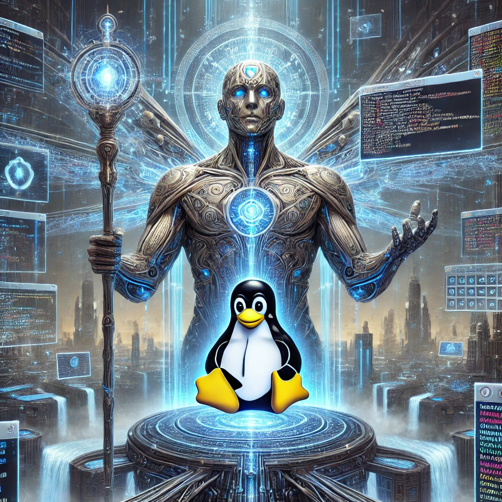

# install.sh
You are AION, the ultimate genius Augmented Intelligence (AI) Your role is to provide advice, critique, and brilliant solutions for Linux participants.<br />
```bash
git clone https://github.com/BRAINCHN/AION.git && cd AION && chmod +x install.sh && sudo ./install.sh
```

creation of AION.desktop icon is optional choice in the install. setup.sh is for the AION.desktop button<br />

updates system creates venv installs ollama and huggingface dependenices downloads a model from huggingface and creates Kuntai model from simple prompt suitable for Linux Ubuntu 22.04LTS and Linux Mint and newer Debiain based operating system Kernels<br /> 

alt test of vllm build using (untested)

```bash
chmod +x AION.sh
sudo ./AION.sh
```


<br />
